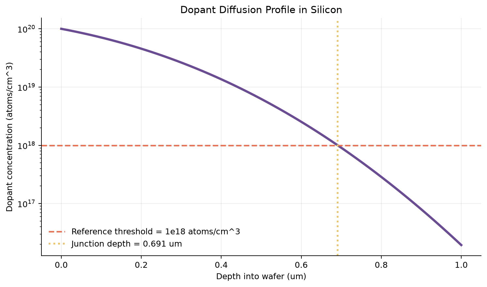

# Silicon Dopant Diffusion

An engineering simulation of constant-surface-concentration dopant diffusion into a silicon wafer.

## Model

The concentration profile follows the complementary-error-function solution to Fick's second law:

```text
C(x,t) = Cs erfc(x / (2 sqrt(Dt)))
```

using:

- Diffusivity `D = 1e-13 cm^2/s`
- Diffusion time `t = 3600 s`
- Surface concentration `Cs = 1e20 atoms/cm^3`
- Simulated depth range of 0 to 1 micrometer

At a reference concentration of `1e18 atoms/cm^3`, the calculated junction depth is approximately **0.691 micrometers**.



## Run

```bash
pip install -r requirements.txt
python project_5_dopant_diffusion.py
```

The program writes the graph and its CSV dataset under `results/project_5_dopant_diffusion/`.
